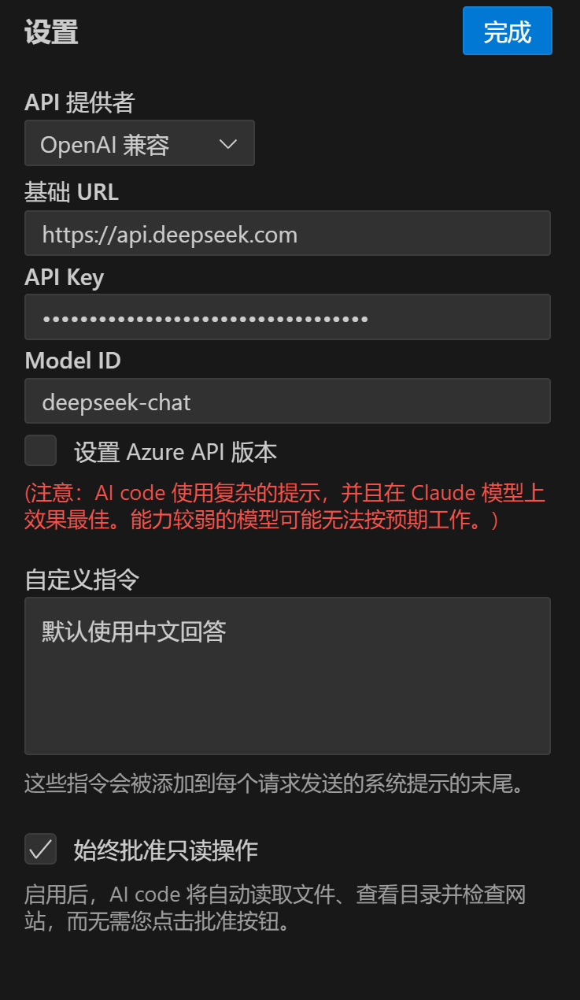

# AI code

  

<table>
<tbody>
<td align="center">
<a href="https://marketplace.visualstudio.com/items?itemName=tianguaduizhang.claude-dev-china" target="_blank"><strong>在VS Marketplace下载</strong></a>
</td>
<td align="center">
<a href="https://github.com/Ciciella/AIcoder/discussions/1"><strong>功能请求</strong></a>
</td>
</tbody>
</table>

认识AI code，一个可以使用你的**CLI**和**编辑器**的AI助手。

得益于[Claude 3.5 Sonnet的代理编码能力](https://www-cdn.anthropic.com/fed9cc193a14b84131812372d8d5857f8f304c52/Model_Card_Claude_3_Addendum.pdf)，AI code可以逐步处理复杂的软件开发任务。通过允许他创建和编辑文件、探索大型项目以及执行终端命令（在你授权后），他可以以超越代码补全或技术支持的方式协助你。虽然自主AI脚本传统上在沙盒环境中运行，但此扩展提供了一个人机交互的GUI来批准每个文件更改和终端命令，提供了一种安全且可访问的方式来探索代理AI的潜力。

1. 输入你的任务并添加图像，将模型转换为功能性应用程序或通过截图修复错误。
2. AI code首先通过分析你的文件结构和源代码ASTs、运行正则表达式搜索以及读取相关文件来了解现有项目。通过仔细管理添加到上下文中的信息，AI code可以在不压倒上下文窗口的情况下为大型复杂项目提供有价值的帮助。
3. 一旦AI code获得所需信息，他可以：
    - 创建和编辑文件+在此过程中监控linter/编译器错误，让他主动修复诸如缺少导入和语法错误等问题。
    - 直接在你的终端中执行命令并在工作时监控其输出，让他例如在编辑文件后对开发服务器问题做出反应。
    - 对于Web开发任务，AI code可以在无头浏览器中启动网站以捕获截图和控制台日志，允许他修复运行时错误和视觉错误。
4. 当任务完成时，AI code会通过一个终端命令如`open -a "Google Chrome" index.html`向你展示结果，你可以通过点击按钮来运行。

> [!提示]
> 使用`CMD/CTRL + Shift + P`快捷键打开命令面板并输入“AI code: Open In New Tab”以在编辑器中以选项卡形式打开扩展。这让你可以与文件资源管理器并排使用AI code，更清楚地看到他如何改变你的工作空间。

---

### API提供商
国产模型和openAI兼容的api key 均可使用

<!--  -->

### 使用任何API和模型

AI code支持OpenRouter、Anthropic、OpenAI、Google Gemini、AWS Bedrock、Azure和GCP Vertex等API提供商。你还可以配置任何兼容OpenAI的API，或通过Ollama使用本地模型。如果你使用OpenRouter，扩展会获取他们的最新模型列表，让你在新模型可用时立即使用。

扩展还会跟踪整个任务循环和单个请求的总令牌和API使用成本，让你在每一步都了解支出。

<!-- 透明像素以在浮动图像后创建换行 -->

 

### 在终端中运行命令

感谢VSCode v1.93中的新[终端壳集成更新](https://code.visualstudio.com/updates/v1_93#_terminal-shell-integration-api)，AI code可以直接在你的终端中执行命令并接收输出。这使他能够执行从安装软件包和运行构建脚本到部署应用程序、管理数据库和执行测试的广泛任务，同时适应你的开发环境和工具链以正确完成工作。

对于长时间运行的进程如开发服务器，使用“Proceed While Running”按钮让AI code在命令在后台运行时继续任务。当AI code工作时，他会在过程中收到任何新的终端输出通知，让他对可能出现的问题做出反应，例如编辑文件时的编译时错误。

<!-- 透明像素以在浮动图像后创建换行 -->

 

### 创建和编辑文件

AI code可以直接在你的编辑器中创建和编辑文件，向你展示更改的差异视图。你可以直接在差异视图编辑器中编辑或还原AI code的更改，或在聊天中提供反馈，直到你对结果满意。AI code还会监控linter/编译器错误（缺少导入、语法错误等），以便他可以在过程中自行修复出现的问题。

AI code所做的所有更改都记录在你文件的时间轴中，提供了一种简单的方法来跟踪和还原修改（如果需要）。

<!-- 透明像素以在浮动图像后创建换行 -->

 

### 分析图像和浏览器截图

像Claude 3.5 Sonnet这样的模型现在可以理解和分析图像，允许多模式工作流的激动人心的可能性。直接在聊天中粘贴图像，为AI code提供无法用语言解释的上下文，并将模型转换为应用程序，通过截图修复错误等。

AI code还可以使用无头浏览器检查任何网站，例如localhost，允许他捕获截图和控制台日志。这使他能够自主修复视觉错误和运行时问题，而无需你手动操作和复制粘贴错误日志。

<!-- 透明像素以在浮动图像后创建换行 -->

 

### 添加上下文

-   **`@url`:** 粘贴一个URL以供扩展获取并转换为markdown，当你想给AI code最新文档时很有用
-   **`@problems`:** 添加工作区错误和警告（“问题”面板）以供AI code修复
-   **`@file`:** 添加文件内容，这样你就不必浪费API请求批准读取文件（+类型以搜索文件）
-   **`@folder`:** 一次性添加文件夹的文件以加快你的工作流程

### 原作者仓库地址

<a href="https://github.com/cline/cline">GitHub</a>

## 许可证

[Apache 2.0 © 2024 AI code Bot Inc.](./LICENSE)
